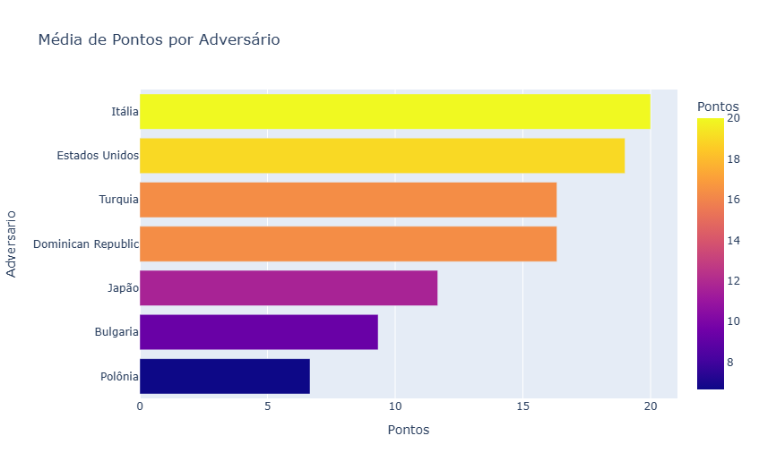
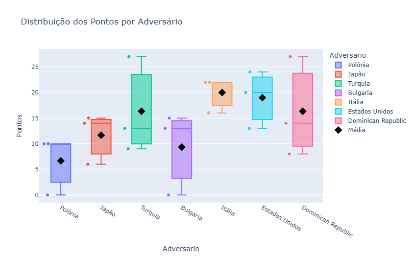
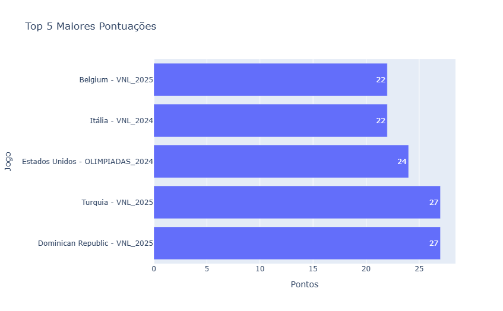
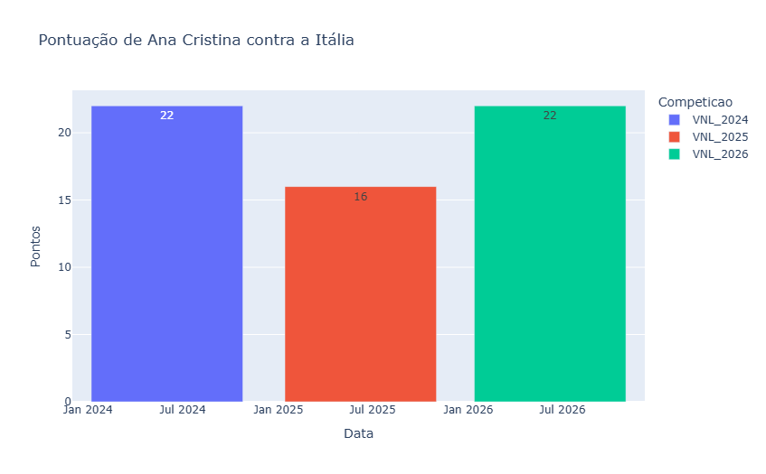
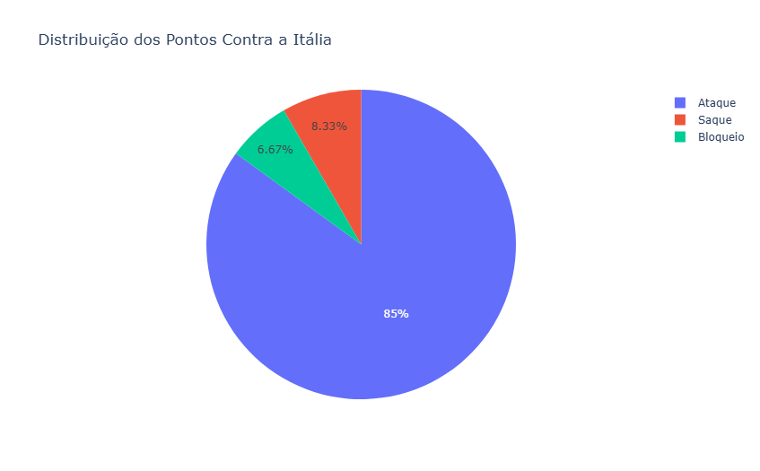

# Efeito Itália? Uma análise do desempenho de Ana Cristina pela Seleção Brasileira Feminina de Vôlei

## Introdução

Ana Cristina é uma das principais atletas da Seleção Brasileira Feminina de Vôlei. Observando alguns confrontos recentes, surgiu a seguinte questão:

**A atleta realmente apresenta um desempenho superior quando enfrenta a seleção italiana?**

Para responder essa pergunta foi desenvolvido um projeto de Ciência de Dados utilizando técnicas de coleta, tratamento e análise de dados esportivos.

---

# Objetivo

Investigar o desempenho de Ana Cristina em partidas disputadas entre 2024 e 2026 e comparar sua produção ofensiva contra diferentes seleções.

Perguntas investigadas:

* Contra quais seleções a atleta apresenta maior média de pontuação?
* O desempenho contra a Itália é superior ao observado contra outros adversários?
* Esse desempenho é consistente ao longo dos confrontos?
* Quais fundamentos contribuem para a pontuação da atleta?

---

# Fonte dos Dados

Os dados foram coletados através de Web Scraping em páginas oficiais da Volleyball World.

Competições analisadas:

* Volleyball Nations League 2024
* Jogos Olímpicos de Paris 2024
* Volleyball Nations League 2025
* Volleyball Nations League 2026

---

# Tecnologias Utilizadas

* Python
* Pandas
* NumPy
* BeautifulSoup
* Requests
* Plotly
* Matplotlib

---

# Engenharia de Dados

O processo de construção do dataset envolveu:

1. Coleta das tabelas disponibilizadas pela Volleyball World;
2. Extração das estatísticas por partida;
3. Padronização dos nomes das seleções;
4. Conversão de datas;
5. Criação das variáveis auxiliares;
6. Consolidação dos dados em um único dataset.

Cada linha representa uma partida disputada por Ana Cristina.

---

# Análise Exploratória

## Frequência dos Confrontos

Para garantir comparabilidade entre os grupos analisados, foram consideradas apenas seleções com pelo menos três confrontos registrados.

---

# Média de Pontos por Adversário

Resultado observado:

A Itália apresentou a maior média de pontuação entre os adversários analisados.

Interpretação:

Os confrontos contra a Itália apresentaram produção ofensiva superior à observada contra as demais seleções incluídas no recorte.

---

# Distribuição das Pontuações

Resultado observado:

Além da maior média, a Itália apresentou uma distribuição mais consistente das pontuações.

Interpretação:

O desempenho elevado não foi consequência de uma única atuação excepcional, mas de resultados consistentemente altos.

---

# Maiores Atuações

Resultado observado:

Os maiores picos de pontuação ocorreram contra Turquia e República Dominicana.

**Interpretação**

Embora a Itália apresente a maior média, os maiores desempenhos individuais ocorreram contra outros adversários. Isso demonstra que média e desempenho máximo não necessariamente coincidem.

Ainda assim, esse alto nível de pontuação contra a República Dominicana e a Turquia foi observado de forma isolada em determinadas competições. Nos demais confrontos contra essas seleções, Ana Cristina não apresentou pontuações tão elevadas.

Esse comportamento pode estar relacionado a fatores não contemplados neste estudo, como tempo efetivo em quadra, quantidade de sets disputados ou substituições realizadas durante as partidas.

Além disso, confrontos mais longos, especialmente aqueles decididos no tie-break (3x2), naturalmente oferecem mais oportunidades de pontuação.

Diante disso, o desempenho contra a Itália continua sendo um destaque. Apesar de não concentrar as maiores pontuações individuais da análise, Ana Cristina manteve um nível elevado e consistente de produção ofensiva nos três confrontos analisados, evidenciando uma regularidade que não foi observada com a mesma intensidade contra outras seleções.

---

# Estudo de Caso: Itália

## Pontuação por Competição

Resultado observado:

* VNL 2024: 22 pontos
* VNL 2025: 16 pontos
* VNL 2026: 22 pontos

Interpretação:

O desempenho apresentou estabilidade ao longo das temporadas analisadas.

---

# Distribuição dos Fundamentos

Resultado observado:

A maior parte dos pontos obtidos contra a Itália teve origem em ações de ataque.

Interpretação:

O ataque foi o principal fundamento responsável pela produção ofensiva da atleta.

---

# Limitações

Os dados utilizados representam a produção estatística por partida.

Não foram consideradas variáveis como:

* Tempo em quadra;
* Quantidade de sets disputados;
* Condição de titularidade;
* Participação em sets específicos.

Portanto, diferenças de pontuação podem refletir tanto desempenho quanto volume de participação.

---

# Conclusões

A análise indicou que a Itália foi o adversário contra o qual Ana Cristina apresentou a maior média de pontuação entre as seleções analisadas.

O boxplot demonstrou que esse resultado foi acompanhado de maior regularidade, e não apenas de atuações isoladas.

A investigação dos fundamentos revelou que o ataque foi o principal responsável pela produção ofensiva da atleta.

Esses resultados sugerem que os confrontos contra a Itália representam um contexto em que Ana Cristina consegue manter níveis elevados e consistentes de desempenho ofensivo.

---

# Próximos Passos

Possíveis extensões deste projeto:

* Inclusão de estatísticas por set;
* Análise de eficiência ofensiva;
* Comparação com outras ponteiras da seleção brasileira;
* Construção de métricas de desempenho por set jogado;
* Modelagem preditiva de desempenho futuro.
